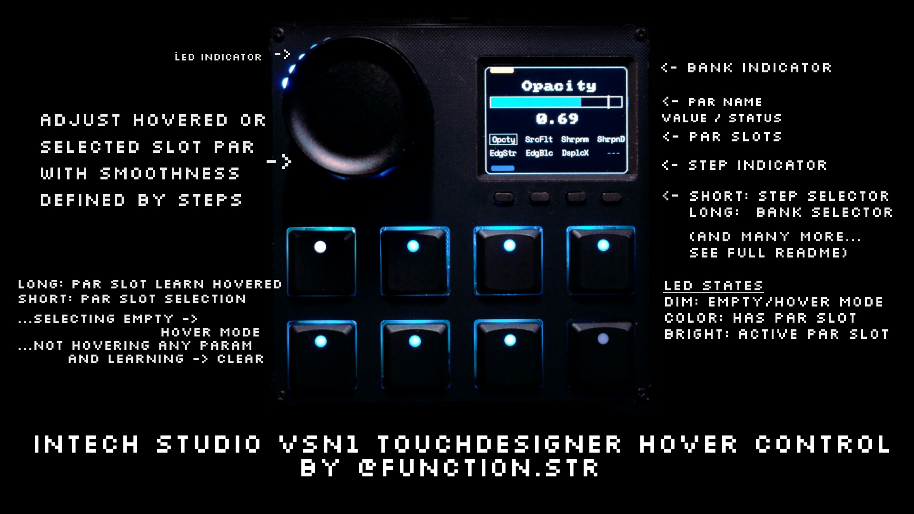

# TouchDesigner Par Hover Control for Intech VSN1

  by <strong><a href="https://github.com/function-store" style="color: #8fa3ff; text-decoration: none;">Function Store</a></strong>

A [TouchDesigner](https://derivative.ca) component designed for the **[Intech Studio VSN1](https://intech.studio/se/shop/vsn1?sku=grid3-vsn1-r)** that provides intuitive parameter control using **endless relative MIDI encoders** and mouse hover interactions.

  

  <a href="https://github.com/function-store/TD_ParHoverMIDI_VSN1/releases/latest/download/ParHoverMIDI_VSN1.tox" 
     style="display: inline-block; padding: 20px 50px; background: linear-gradient(135deg, #667eea 0%, #764ba2 100%); 
            color: white; text-decoration: none; border-radius: 10px; font-size: 22px; font-weight: bold; 
            box-shadow: 0 6px 20px rgba(102, 126, 234, 0.5); transition: all 0.3s ease;">
    ⬇️ Download ParHoverMIDI_VSN1.tox
  </a>
  

    <a href="https://github.com/function-store/TD_ParHoverMIDI_VSN1/releases/latest" style="color: #8fa3ff; text-decoration: none;">Latest Release</a> • Includes Auto-Updater
  

---

## ✨ Key Features

- **Hover-based Control** - Adjust any parameter by simply hovering your mouse over it
- **VSN1 Integration** - Full screen and LED feedback on VSN1 hardware
- **Parameter Slots** - Save parameters to buttons for instant recall across multiple banks
- **ParGroup Support** - Control entire parameter groups (RGB, XYZ) simultaneously
- **Smart Recovery** - Automatic detection and fixing of invalid parameters when operators move
- **Auto-Updates** - Built-in updater with one-click updates from GitHub
- **Flexible Precision** - Multiple step sizes with Fixed or Adaptive modes
- **Parameter Shortcuts** - Quick button combos for reset, set default, clamp, and more

---

## 📖 Documentation

  

    <h3 style="margin-top: 0; color: #8fa3ff;">🚀 Getting Started</h3>
    
Installation, MIDI setup, and first steps to get up and running quickly.

    <a href="getting-started.html" style="color: #8fa3ff; font-weight: bold; text-decoration: none;">Read Guide →</a>
  

  
  

    <h3 style="margin-top: 0; color: #8fa3ff;">📚 User Guide</h3>
    
Complete guide to all features: slots, banks, shortcuts, undo/redo, and customization.

    <a href="user-guide.html" style="color: #8fa3ff; font-weight: bold; text-decoration: none;">Read Guide →</a>
  

  
  

    <h3 style="margin-top: 0; color: #8fa3ff;">🔍 Quick Reference</h3>
    
Fast lookup tables for controls, shortcuts, parameters, and MIDI mappings.

    <a href="reference.html" style="color: #8fa3ff; font-weight: bold; text-decoration: none;">View Reference →</a>
  

  
  

    <h3 style="margin-top: 0; color: #8fa3ff;">⚙️ Advanced Guide</h3>
    
Recovery system, production setup, MIDI mapping details, and troubleshooting.

    <a href="advanced.html" style="color: #8fa3ff; font-weight: bold; text-decoration: none;">Read Guide →</a>
  

---

## 🎛️ Hardware Compatibility

**Primary Target:**
- **Intech Studio VSN1** - Full support with screen updates and LED feedback

**Requirements:**
- TouchDesigner 2023.12120+
- USB connection to MIDI controller
- For VSN1: Grid Editor open with exclusive access to port `9642`

<strong>Alternative Hardware (Other MIDI Controllers)</strong>

- Generic MIDI controllers with endless encoders in relative mode
- Turn off `VSN1 Support` parameter for non-VSN1 controllers
- See [Getting Started - Setup for Other MIDI Controllers](getting-started.html#setup-for-other-midi-controllers) for details

---

## 🚀 Quick Start (VSN1)

1. **Install Grid Package**: Install `TouchDesigner Par Hover Control` from Grid Editor Package Manager. From the Cloud import `TouchDesigner Par Hover Control` profile to your VSN1!
   - *Not available in your Package Manager?* See [Getting Started - Grid Editor Setup](getting-started.html#grid-editor-setup-vsn1-users-only) for manual installation
2. **Download**: Get the latest `.tox` file using the button above
3. **Setup**: Set up your MIDI device, Drag into TouchDesigner at root `/`, set Device ID
4. **Use**: Hover over any parameter and twist your encoder!
5. **Explore**: There's much more this component can do, so keep on reading!

**👉 [Full installation guide](getting-started.html)**

---

## 🤝 Contributing

Contributions are welcome! Visit the [GitHub repository](https://github.com/function-store/TD_ParHoverMIDI_VSN1) to:
- Report issues
- Submit pull requests
- View source code
- Star the project ⭐

### Patreon

You can also support my work on [Patreon](patreon.com/function_store) where I have a lot of free and exclusive stuff!

---

## 🙏 Contributors & Acknowledgments

**Main Developer:**
- **[Function Store](https://www.functionstore.xyz/link-in-bio)** - Project creator and lead developer

**Special Thanks:**
- **[Greg Orca](https://www.instagram.com/greg_orca/)** - Valuable feedback and ongoing support
- **[Dániel Pásztor](https://github.com/danim1130)** - Queued screen updates and GitHub Actions implementation
- **[Intech Studio](https://intech.studio/)** - General support and hardware collaboration
- **[TheTouchLab](https://www.instagram.com/thetouchlab/)** - Network Editor mouse position tracking

---

## 📝 License

See [LICENSE](https://github.com/function-store/TD_ParHoverMIDI_VSN1/blob/main/LICENSE) file for details.

---

  

    <strong>Support:</strong> Contact @function.str on Discord or <a href="https://github.com/function-store/TD_ParHoverMIDI_VSN1/issues" style="color: #8fa3ff;">open an issue</a>
  

  

    Made with ❤️ for the TouchDesigner community
  

