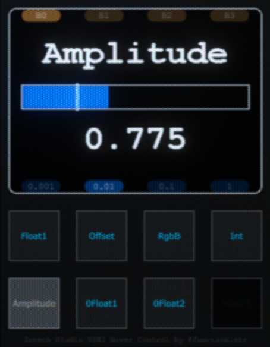

# User Guide

Complete guide to all features and customization options.

> **New to this component?** Start with [Getting Started](getting-started.html) to install and configure everything first.

## Overview

This component transforms how you control TouchDesigner parameters by combining mouse hover detection with MIDI encoders. Beyond basic hover control, you get:

- **Precision Control**: Multiple step sizes with Fixed or Adaptive modes
- **Slots & Banks**: Save parameters to buttons for instant recall across multiple banks
- **Shortcuts**: Quick button combos for reset, default, clamp operations
- **Multi-Operator Editing**: Adjust the same parameter on multiple selected operators simultaneously
- **ParGroups**: Control entire parameter groups (RGB, XYZ) simultaneously  
- **Undo/Redo**: Full undo support for all operations
- **Auto-Recovery**: Automatic fixing when operators are moved/renamed
- **Network Zoom**: Smooth zoom and pan navigation when no parameter is active

## Table of Contents

- [Step Modes](#step-modes)
- [Parameter Slots System](#parameter-slots-system)
- [Multiple Banks](#multiple-banks)
- [Parameter Shortcuts](#parameter-shortcuts)
- [Multi-Operator Editing](#multi-operator-editing)
- [Undo/Redo Operations](#undoredo-operations)
- [Parameter Pulse](#parameter-pulse)
- [UI Parameter Highlighting](#ui-parameter-highlighting)
- [Hover Timeout](#hover-timeout)
- [Network Zoom Navigation](#network-zoom-navigation)
- [Visual Feedback](#visual-feedback)
- [Grid Editor Settings (VSN1)](#grid-editor-settings-vsn1)

> **🔍 Looking for quick reference tables?** See the [Quick Reference](reference.html) page for complete tables of controls, shortcuts, parameters, and MIDI mappings.

> **💡 Tip**: This guide focuses on features and usage. For installation and setup, see [Getting Started](getting-started.md).

---

## Step Modes

Control how precisely you adjust parameters with multiple step sizes and modes.

> **VSN1 Users**: Step buttons are the small dark buttons located under the LCD screen.

### Adjusting Precision

Use your mapped step buttons to cycle through step sizes:
- **Default steps**: 0.001, 0.01, 0.1, 1
- **Configurable** in the component's **Mapping** tab
- Current step size is displayed on the VSN1 screen

### Step Mode: Fixed vs Adaptive

Two calculation modes determine how parameter adjustments scale:

**Fixed Mode** (default):
- Uses exact configured step size (e.g., 0.01 = 0.01 increment)
- Same increment regardless of parameter range
- Best for consistent, predictable adjustments
- Example: 0.001 step always increments by exactly 0.001

**Adaptive Mode**:
- Step automatically scales to parameter's min/max range
- Larger ranges = larger steps, smaller ranges = smaller steps  
- Best for parameters with varying ranges
- Example: 0.001 step on 0-1 range = 0.001, but on 0-1000 range = 1

**Switching Modes:**
- **Via Parameter**: Set `Step Mode` custom parameter to "Fixed" or "Adaptive"
- **Via Shortcut**: Press leftmost + rightmost step buttons simultaneously
- **Visual Feedback**: VSN1 shows "_FIXED_" or "_ADAPT_" and bar outline changes color (white = Fixed, colored = Adaptive)

### Push Step Mode

Hold the knob push button while rotating for alternate precision control:

**Fixed**:
- Hold push + rotate = uses alternate step size
- Set via `Push Step` custom parameter
- **Quick assign**: Hold push button + press any step button to set that step as the alternate

**Finer**:
- Hold push + rotate = current step ÷ 10
- Gradually increase precision as needed

**Coarser** (default):
- Hold push + rotate = current step × 10
- Gradually decrease precision for faster adjustments

---

## Parameter Slots System

Save parameters to MIDI buttons for instant recall without hovering. Slots work in "sticky mode" - once activated, hovering over other parameters has no effect until you return to hover mode.

> **VSN1 Users**: Slot buttons are the 8 clicky keyboard buttons on your device.

### Assigning Slots

1. **Hover over a parameter** (or parameter group) you want to save
2. **Long-press a slot button** on your controller
3. The parameter is now stored in that slot for instant recall

### Using Slots

- **Press a slot button** to activate that parameter (enters sticky mode)
- **Adjust with encoder** without needing to hover over the parameter
- **Press an empty slot button** to return to hover mode
- **Hold knob push + press slot** to jump to that parameter's operator in the network

### Managing Slots

**Clear a slot:**
- While NOT hovering over any parameter, long-press the slot button you want to clear

**Reassign a slot:**
- With a slot active, hover over a different parameter and long-press the same slot button

### Slot States (Visual Feedback)

- **Dark LED**: Slot is empty and available for assignment
- **Dim LED**: Slot has parameter assigned but not currently active
- **Bright LED**: Slot is currently active and controlling this parameter

### ParGroup Support

Assign entire parameter groups (like RGB, XYZ) to slots for simultaneous control:

- **Hover over parameter groups** (RGB, XYZ, etc.) to assign the entire group
- **Groups display with `>` prefix** (e.g., `>Color`) to distinguish from single parameters
- **Rotating the knob** adjusts all valid parameters in the group simultaneously
- **Parameters with expressions/exports** are automatically skipped during manipulation
- **Single-parameter groups** are treated as individual parameters (no `>` prefix)

### Jump to Operator

**Hold knob push button + press slot button** to jump to that parameter's operator in the network

> Parameter slots and their assignments are saved with your project file.

---

## Multiple Banks

Organize your parameter slots into multiple banks to dramatically expand your control capabilities. Each bank is completely independent with its own set of slot assignments.

> **VSN1 Users**: Long-press any Step button (small dark buttons under the LCD) to switch banks.

### How Banks Work

- **Independent Storage**: Each bank has its own set of slots (e.g., 8 slots per bank)
- **Separate Assignments**: Banks remember their own parameter-to-slot mappings
- **Active Slot Memory**: Each bank remembers which slot was last active
- **Instant Switching**: Switch banks and immediately access different parameter sets

### Switching Banks

1. **Long-press a Step button** to switch to that bank
2. Slot assignments and labels instantly update to show that bank's parameters
3. If you had an active slot in this bank, it automatically becomes active again
4. Bank number displayed on VSN1 screen and in UI

---

## Parameter Shortcuts

Quick button combinations for common operations (works with step or bank buttons):

### Button Combinations

| Buttons | Action |
|---------|--------|
| **First + Second** | Reset to default value |
| **First + Third** | Set current value as default |
| **Second + Third** | Set current value as min (normMin and min) |
| **Second + Fourth** | Set current value as max (normMax and max) |
| **Third + Fourth** | Clamp value to min/max range |
| **First + Fourth (long press)** | Open component editor (active parameter's operator, or currently selected COMP if none) |

### Usage Notes

- Press and hold combinations while hovering or controlling parameters
- **Set default, set min, set max, and clamp** only work on custom parameters (reset works on all parameters)
- Min/max affects both visual slider and actual parameter bounds
- Clamping brings values within defined range
- Component editor shortcut: Opens active parameter's operator editor, or currently selected COMP's editor if no parameter is active

---

## Multi-Operator Editing

Adjust the same parameter across multiple selected operators simultaneously in hover mode.

### How It Works

When you select multiple operators of the same type and hover over a parameter:

1. **Adjust the parameter** on the hovered operator
2. **All selected operators** of the same type have that parameter adjusted automatically
3. **Single undo/redo** - all changes are grouped together

### Modes

Configure multi-adjust behavior via the `Multi Adjust Mode` parameter:

| Mode | Behavior |
|------|----------|
| **Off** | Disabled - only adjusts hovered operator |
| **Snap** | All matching parameters snap to the same value |
| **Relative** | Each parameter adjusts by the same amount (preserves relative differences) |

### What Gets Adjusted

The system automatically finds:
- Operators with the **same type** as the hovered operator (e.g., all `constantCOMPs`)
- That are **currently selected**
- And adjusts their **matching parameter** (by name)

### Works With

- ✅ **Knob adjustments** - value changes
- ✅ **Push button** - pulse/momentary/toggle
- ✅ **Parameter shortcuts** - reset, set default, set min/max, clamp
- ✅ **Undo/redo** - all changes are grouped

### Requirements

- Only works in **hover mode** (not when using slots)
- All parameters must be **custom parameters** for default/min/max/clamp operations
- Selected operators must be the **same type**

### Example Use Cases

**Snap Mode**: Set multiple Constant TOPs to the same color
- Select 5 `constantTOPs`
- Hover over `colorr` on one of them
- Adjust → All 5 snap to the same red value

**Relative Mode**: Brighten multiple lights proportionally
- Select 3 Constant TOPs with different brightness values (0.3, 0.5, 0.8)
- Hover over `colorr` on one
- Increase by 0.1 → All increase by 0.1 (now 0.4, 0.6, 0.9)

> **💡 Tip**: Use **Relative mode** to maintain existing differences between parameters while adjusting them together. Use **Snap mode** to synchronize all parameters to the same value.

---

## Undo/Redo Operations

Full undo/redo support for parameter changes and slot management.

### What's Tracked

- All parameter value changes via MIDI
- Parameter resets and shortcuts
- Slot assignments
- Slot clearing
- Works across banks and parameters

### Key Features

- **History Tracking**: Complete history of all actions through the component
- **Cross-Parameter**: Undo changes to any parameter you've adjusted
- **Bank-Aware**: Works seamlessly across bank switches
- **Smart Validation**: Checks parameters still exist before restoring values

> Controlled by `Enable Undo` parameter (see [Customization](#customization-parameters))

---

## Parameter Pulse

Trigger actions on special parameter types using the Pulse button.

**Parameter Types:**
- **Pulse parameters**: Triggers pulse action
- **Momentary parameters**: Can be held for momentary trigger
- **Toggle parameters**: Toggles on/off
- **Other types**: No action

## UI Parameter Highlighting

Visual feedback in TouchDesigner interface.

### Global UI Color System

- **Hover Mode**: Parameter UI elements shift color to indicate hover mode active
- **Slot Mode**: UI colors reset to normal (slot controlling parameter)
- **Mode Transitions**: Instant color changes when switching modes

> **Note**: Can cause performance impact when switching modes. Toggle via `Enable UI Color` parameter.

### Parameter Color Coding

- **Hovered Parameters**: Highlighted in distinct color
- **UI Mirroring**: Shows hardware states directly in TD interface

### Component UI Button

Convenient button in top-right corner of TD's UI:

- **Left Click**: Opens component parameters dialog
- **Right Click**: Opens component UI view
- **Middle Click**: Toggles UI coloring on/off

---

## Hover Timeout

Control how long parameters remain active **after you stop hovering** over them.

> **While Hovering**: Parameters stay active indefinitely. You can adjust them freely with MIDI controls. Timeout and sticky settings have no effect while your cursor is over a parameter.

### Timeout Length

Set `Hover Timeout Length` parameter (in seconds) to control what happens **after you move your cursor away**:

- **Greater than 0**: Parameter stays active for the specified duration, then clears
- **Set to 0**: Parameter clears immediately when you unhover

After the timeout expires, the component returns to showing the `_HOVER_` message.

### Sticky Parameter

The `Sticky Par` toggle only matters **after you've moved your cursor away**. It controls whether MIDI adjustments extend the timeout:

**Enabled**:
- You move cursor away → timeout countdown starts
- You adjust with MIDI → countdown restarts (parameter stays active longer)
- You stop adjusting → parameter clears after timeout duration
- Result: Parameter stays active as long as you're adjusting it
- **Bonus**: Hovering over invalid parameters (unsupported types, read-only, etc.) is ignored - keeps your valid parameter active. Expression parameters still show.

**Disabled**:
- You move cursor away → timeout countdown starts
- You adjust with MIDI → countdown continues unchanged
- Parameter clears after the original timeout, even if you're still adjusting
- Result: Parameter has a fixed lifetime from when you unhover

**Summary:**
- **While hovering**: Parameters stay active indefinitely, regardless of settings
- **After unhovering**: Timeout and sticky settings determine how long the parameter remains active
- **In slot mode**: Parameters stay active until you deactivate the slot (timeout doesn't apply)
- **With sticky enabled**: Invalid parameters (except expressions) are ignored, preventing accidental interruption of your workflow

---

## Network Zoom Navigation

When no parameter is active (no hover, no active slot), use your MIDI knob to zoom and navigate in the network editor.

> **⚠️ Important**: Zoom is only available when no parameter is active. If you've recently hovered a parameter, you must wait for the [Hover Timeout](#hover-timeout) to expire before zoom becomes available. Set `Hover Timeout Length` to 0 for immediate access to zoom after unhovering.

### Enabling Zoom

Set `Enable Zoom` toggle to activate network zoom navigation. When enabled and no parameter is active, rotating your knob controls zoom and panning.

### Zoom Behavior

**Zoom Amount**: Set `Zoom Network` parameter to control zoom speed per knob increment (default: 0.015).
- **Higher values**: Faster zoom
- **Lower values**: More precise control
- **Set to 0**: Disables zoom (even if `Enable Zoom` is on)
- **Negative values**: Reverses zoom direction

**Push for Fast Zoom**: Hold the knob push button while rotating for 5× faster zoom speed.

**Home Network**: Double-click the knob push button to home the network editor (fit all to view).

**Zoom Limit**: Zooming in stops at 3× magnification (configurable in `zoom_manager.py`). You can still:
- Zoom out from any zoom level
- Pan around at maximum zoom by continuing to rotate the knob

### Zoom Modes

Set `Zoom Mode` parameter to choose targeting behavior:

**Seek Mode** (default):
- Camera continuously **follows** your cursor position
- Each zoom action updates target to current mouse location
- Great for dynamic navigation while exploring
- Smooth interpolation prevents jarring jumps

**Target Mode**:
- Camera **locks** to initial cursor position when you start zooming
- Target stays fixed until you stop zooming (timeout expires)
- Great for precise zooming to a specific point
- Ideal when you want the zoom center to stay consistent

Both modes use smooth interpolation to prevent sudden camera jumps.

### Zoom Interpolation

Set `Zoom Interpolation` parameter (0.0 to 1.0, default: 0.015) to control smoothness:
- **Lower values** (0.05-0.10): Very smooth, gradual movement
- **Default** (0.15): Balanced smoothness and responsiveness  
- **Higher values** (0.20-0.30): More responsive, less smoothing
- **Value of 1.0**: Instant (no interpolation)

The interpolation determines what percentage of the distance to the target position is covered with each knob turn.

### How It Works

1. **No active parameter**: Knob controls zoom + panning
2. **Hover parameter**: Knob adjusts parameter value, zoom state clears automatically
3. **Unhover parameter**: Parameter stays active for `Hover Timeout Length` duration
4. **Timeout expires**: Parameter clears, zoom becomes available again

**Typical Workflow:**
- Adjust parameter → Move cursor away → Wait for timeout → Zoom becomes available
- For instant zoom access: Set `Hover Timeout Length` to 0
- For extended parameter control: Set timeout > 0 and enable `Sticky Par`

**Note**: Activating a slot also makes zoom unavailable until you deactivate the slot and return to hover mode.

> **Credit**: Network Editor mouse position tracking functionality was contributed by [TheTouchLab](https://www.instagram.com/thetouchlab/). 🙏

---

## Customization Overview

The component offers extensive customization through custom parameters organized in the parameter dialog.

> **💡 Parameter Help**: Hover over any custom parameter in the component while holding **Alt** (or **Option** on Mac) to see detailed help text for that parameter.

### Key Customization Areas

- **Step Configuration**: Adjust step sizes, modes (Fixed/Adaptive), and push behavior
- **Parameter Behavior**: Control menu looping, StrMenu support
- **Undo System**: Configure undo/redo functionality and timeout
- **Shortcuts**: Enable/disable button combos and adjust hold lengths
- **Hover Timeout**: Control how long parameters stay active after unhovering
- **Storage**: Configure external repo for persistent slot/bank data
- **VSN1 Integration**: Screen updates, LED feedback, websocket settings
- **UI Settings**: Color highlighting, internal UI, bloom effects
- **Network Zoom**: Zoom navigation speed, mode, and interpolation
- **MIDI Configuration**: Device ID, channel, learn mode, CC mappings

> **📋 Complete Parameter Reference**: See the [Quick Reference](reference.html#all-parameters) page for a complete table of all 80+ parameters with descriptions and defaults.

---

## Visual Feedback

Comprehensive feedback through hardware and software.

### VSN1 Hardware Feedback

**Button LEDs:**
- Dark: Slot empty (hover mode)
- Dim: Slot assigned but not active
- Bright: Slot currently active

**Screen Display:**
- Parameter name and value
- All slot names always visible (active slot highlighted)
- Default value notch on circle
- Screen outline colors:
  - Color outline = hover mode
  - White outline = slot mode
- Bank indicator (e.g., "Bank 0")
- Step size display when changed and indicated

**Knob LEDs:**
- Value-based gradual fill or step-based indicators (configurable)

### TouchDesigner UI Feedback

- Hovered parameters color-highlighted
- Editable parameters with distinct colors
- Bank indicator in UI
- Real-time updates during interaction

The component includes an optional internal UI display that mirrors the VSN1 screen content directly in TouchDesigner, providing visual feedback even when the hardware screen is not visible:

  
  

    The TouchDesigner UI display mirrors the VSN1 screen, showing parameter values, slot assignments, and bank information in real-time.
  

This UI can be enabled/disabled via the `Enable UI` parameter and is useful for:
- **Development**: See parameter feedback without looking at hardware
- **Screenshots/Documentation**: Capture UI state for reference
- **Multi-monitor setups**: Keep feedback visible on a secondary display
- **Accessibility**: Larger, easier-to-read display than hardware screen

> The UI takes up about half of the performance of the tool, so if you're not using it,
> it is suggested to turn it off!

---

## Grid Editor Settings (VSN1)

Configure VSN1 hardware behavior through the Grid Editor package preferences.

### Accessing Settings

In Grid Editor:
1. Navigate to the **Packages** tab
2. Find **TouchDesigner Par Hover Control** package
3. Click the **gear icon** to open preferences

### Available Settings

#### Connection Behavior

**Turn off LCD when TouchDesigner is disconnected:**
- Default: `Off`
- When enabled: LCD backlight turns off if TouchDesigner disconnects from Grid Editor
- When disabled: LCD stays on regardless of connection state

**Turn off LED when TouchDesigner is disconnected:**
- Default: `On`
- When enabled: All button LEDs turn off if TouchDesigner disconnects
- When disabled: LEDs maintain their last state during disconnection

#### Screen Power Management

**Screen inactivity timeout (minutes):**
- Default: `5 minutes`
- Range: `0` (disabled) to any positive value
- Dims the screen after specified minutes of no MIDI activity
- Set to `0` to disable automatic dimming

**Screen active brightness (0-100%):**
- Default: `100%`
- Controls LCD brightness during normal operation
- Lower values extend battery life

**Screen inactive brightness (0-100%):**
- Default: `0%` (off)
- Controls LCD brightness after inactivity timeout
- Set to `0` to turn screen completely off
- Set higher to dim instead of turning off

### Typical Configurations

**Maximum Battery Life:**
- Screen inactivity timeout: `2 minutes`
- Active brightness: `70%`
- Inactive brightness: `0%`

**Always On, Full Brightness:**
- Screen inactivity timeout: `0` (disabled)
- Active brightness: `100%`
- Inactive brightness: `100%`

**Dim When Idle:**
- Screen inactivity timeout: `5 minutes`
- Active brightness: `100%`
- Inactive brightness: `20%`

> **💡 Tip**: The inactivity timer resets with any MIDI message from TouchDesigner. Screen immediately returns to active brightness when new messages are received.

---

[← Getting Started](getting-started.html) | [Quick Reference](reference.html) | [Advanced →](advanced.html)

